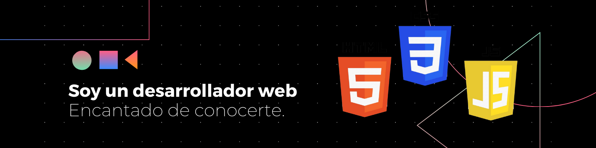

#  Hola Soy Jhonn bienvenid@ a mi GitHub 👋

<h2>Conoce mis proyectos</h2>

<!-- ## 👋 &nbsp;Hola soy jhonn xavier M.T. -->

### 👨🏻‍💻 &nbsp;Especialidades

💡 &nbsp;Me gusta aprender nuevas tecnologias y estar actualizado.\
🎓 &nbsp;Soy Tecnico Superior en Sistemas Informaticos del
Instituto Técnico Comercial Incos El Alto (2021 -2023).\
🌱 &nbsp;Soy actualmente Estudiante de la carrera de Electronica y Telecomunicaciones en la Universidad Mayor de San Andres (UMSA).\
✍️ &nbsp;In my free time, I pursue Graphic Design and Blog Writing as hobbies/side hustles.\
💬 &nbsp;Tengo experiencia en desarrollo web como la realizacion de mi proyecto de grado Sobre :

- Sistema web para la
administración de textiles
Caso: Sporty Stitch.\
📄 &nbsp;Tengo certificados de participacion en ditintos cursos tecnologicos como :
- Desarrollo web moderno con frameworks
JavaScript
organización: JCI Líderes Sucre y Gold Master
(Noviembre de 2024).
- Creación de Dibujos técnicos con Photoshop
organización: JCI Líderes Sucre y Gold Master
(Noviembre de 2024).
- Hacking Ético con redes Wifi con Kali Linux a
Nivel Intermedio Avanzado
Universidad: UPEA
(Abril de 2024)

### 🛠 &nbsp;Tecnologias que domino

&nbsp;
&nbsp;
&nbsp;
&nbsp;
&nbsp;

### 🤝🏻 &nbsp;Contactame mediante mis redes sociales

